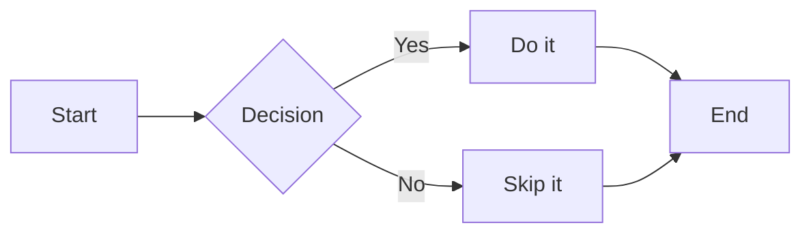
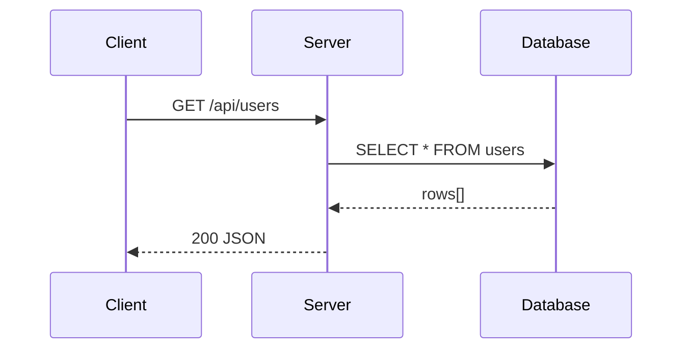
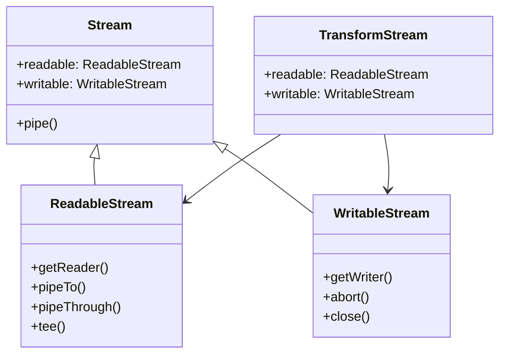
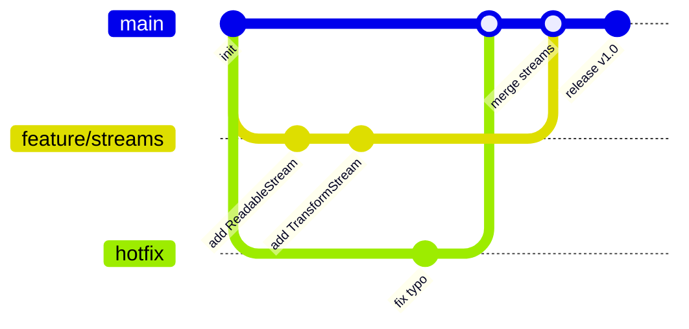

# Diagrams

Shared diagram slides — import any range with `src: ./shared/diagrams.md#N-M`

---
layout: center
---



---
layout: center
---



---
layout: center
---



---
layout: center
---



---
layout: center
---

```mermaid {scale: 0.72}
mindmap
  root((Web Streams))
    ReadableStream
      getReader()
      pipeTo()
      pipeThrough()
      tee()
    WritableStream
      getWriter()
      abort()
      close()
    TransformStream
      TextDecoderStream
      TextEncoderStream
      CompressionStream
    Use Cases
      Fetch body
      File reading
      SSE
      Service Workers
```
