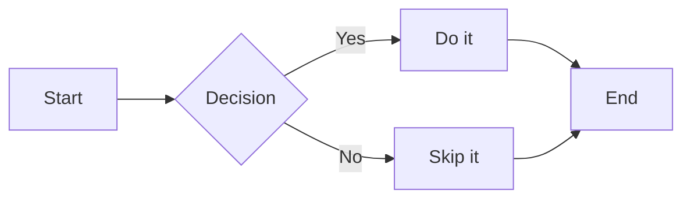
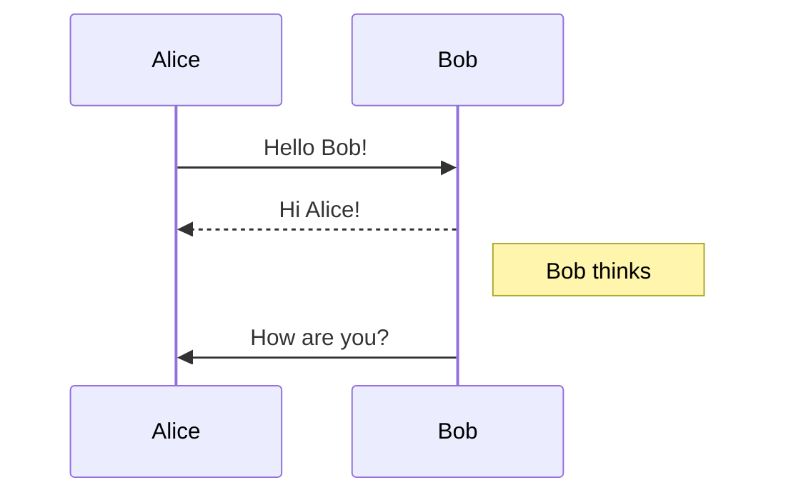
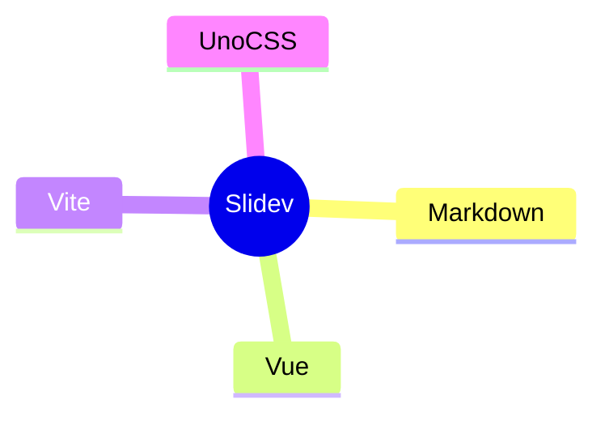
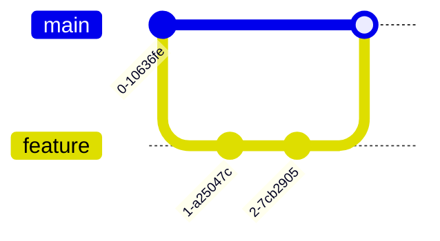
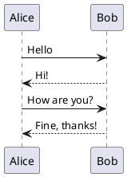

# Slidev & Markdown Syntax

A complete reference — Markdown + Slidev-specific features

<div class="pt-8 text-gray-400">
  <a href="https://sli.dev/guide/syntax" class="underline">sli.dev/guide/syntax</a>
  ·
  <a href="https://github.com/adam-p/markdown-here/wiki/Markdown-Cheatsheet" class="underline">Markdown Cheatsheet</a>
</div>

---
layout: section
---

# Part 1
## Markdown Basics

`Headers` · `Emphasis` · `Blockquotes` · `Horizontal Rules`

---
layout: two-cols
---

# Headers

```markdown
# H1 Heading
## H2 Heading
### H3 Heading
#### H4 Heading
##### H5 Heading
###### H6 Heading
```

Alternative style (H1 / H2 only):

```markdown
H1 Heading
==========

H2 Heading
----------
```

::right::

# H1 Heading
## H2 Heading
### H3 Heading
#### H4 Heading
##### H5 Heading
###### H6 Heading

---
layout: two-cols
---

# Emphasis

```markdown
*italic* or _italic_

**bold** or __bold__

***bold italic*** or ___bold italic___

~~strikethrough~~

`inline code`
```

::right::

<div class="mt-16 space-y-4 text-xl">
  <div>*italic* → <em>italic</em></div>
  <div>**bold** → <strong>bold</strong></div>
  <div>***bold italic*** → <em><strong>bold italic</strong></em></div>
  <div>~~strike~~ → <del>strikethrough</del></div>
  <div>`code` → <code>inline code</code></div>
</div>

---
layout: two-cols
---

# Blockquotes

```markdown
> Single-level blockquote.

> Nested blockquotes:
>
> > Inner level.
> >
> > > Deeper level.

> Blockquotes can contain **Markdown**.
> Even `code` and lists:
> - item one
> - item two
```

::right::

> Single-level blockquote.

> Nested blockquotes:
>
> > Inner level.
> >
> > > Deeper level.

> Blockquotes can contain **Markdown**.  
> Even `code` and lists:
> - item one
> - item two

---

# Horizontal Rules

Three or more hyphens, asterisks, or underscores on their own line:

```markdown
---

***

___
```

They all render identically:

---

---
layout: section
---

# Part 2
## Lists

`Ordered` · `Unordered` · `Nested` · `Task Lists`

---
layout: two-cols
---

# Ordered & Unordered Lists

```markdown
1. First item
2. Second item
3. Third item
   1. Sub-item 3a
   2. Sub-item 3b

- Item A
- Item B
  - Nested B1
  - Nested B2
    - Deeper level
- Item C

* Also works with asterisks
+ And with plus signs
```

::right::

1. First item
2. Second item
3. Third item
   1. Sub-item 3a
   2. Sub-item 3b

- Item A
- Item B
  - Nested B1
  - Nested B2
    - Deeper level
- Item C

---
layout: two-cols
---

# Task Lists

```markdown
- [x] Write the syntax demo
- [x] Add Markdown basics
- [ ] Add code block section
- [ ] Add LaTeX section
- [ ] Deploy to GitHub Pages
```

Task lists use `- [x]` (checked) and `- [ ]` (unchecked).

::right::

<div class="mt-8">

- [x] Write the syntax demo
- [x] Add Markdown basics
- [ ] Add code block section
- [ ] Add LaTeX section
- [ ] Deploy to GitHub Pages

</div>

---
layout: section
---

# Part 3
## Links & Images

`Inline` · `Reference-style` · `Autolinks` · `Images`

---
layout: two-cols
---

# Links

**Inline**
```markdown
[Slidev](https://sli.dev)
[Slidev](https://sli.dev "Presentation tool")
```

**Reference-style**
```markdown
[Slidev][sli]
[GitHub][gh]

[sli]: https://sli.dev
[gh]: https://github.com
```

**Autolinks**
```markdown
<https://sli.dev>
<hello@example.com>
```

::right::

**Rendered:**

<div class="mt-4 space-y-3 text-lg">
  <div><a href="https://sli.dev">Slidev</a></div>
  <div><a href="https://sli.dev" title="Presentation tool">Slidev (with title)</a></div>
  <div>Autolink: <a href="https://sli.dev">https://sli.dev</a></div>
</div>

---
layout: two-cols
---

# Images

**Inline**
```markdown


```

**Reference-style**
```markdown
![Slidev logo][logo]

[logo]: https://sli.dev/logo-square.png
```

**With sizing (HTML)**
```html

```

::right::

<div class="mt-4 space-y-4">
  <div>
    <div class="text-sm opacity-60 mb-1">Inline image:</div>
    
  </div>
  <div>
    <div class="text-sm opacity-60 mb-1">Sized with HTML:</div>
    
    
    
  </div>
</div>

---
layout: section
---

# Part 4
## Tables

GFM table syntax with alignment

---
layout: two-cols
---

# Tables

```markdown
| Left | Center | Right |
|:-----|:------:|------:|
| A    |   B    |     C |
| foo  |  bar   |   baz |

| Feature     | Support |
|-------------|---------|
| Bold        | ✅      |
| Italic      | ✅      |
| Strikethrough | ✅   |
| Tables      | ✅      |
| Code blocks | ✅      |
```

- `:---` left-align
- `:---:` center-align
- `---:` right-align

::right::

| Left | Center | Right |
|:-----|:------:|------:|
| A    |   B    |     C |
| foo  |  bar   |   baz |

| Feature       | Support |
|---------------|---------|
| Bold          | ✅      |
| Italic        | ✅      |
| Strikethrough | ✅      |
| Tables        | ✅      |
| Code blocks   | ✅      |

---
layout: section
---

# Part 5
## Code Blocks

`Syntax highlighting` · `Line numbers` · `Line highlighting` · `Monaco`

---
layout: two-cols
---

# Basic Code Blocks

````markdown
```ts
const greet = (name: string) => `Hello, ${name}!`
console.log(greet('Slidev'))
```

```python
def greet(name: str) -> str:
    return f"Hello, {name}!"

print(greet("Slidev"))
```

```bash
echo "Hello, Slidev!"
npm run dev
```
````

::right::

```ts
const greet = (name: string) => `Hello, ${name}!`
console.log(greet('Slidev'))
```

```python
def greet(name: str) -> str:
    return f"Hello, {name}!"

print(greet("Slidev"))
```

```bash
echo "Hello, Slidev!"
npm run dev
```

---

# Line Highlighting

Highlight specific lines with `{lines}` after the language:

````markdown
```ts {2|3|4|all}
import { ref, computed } from 'vue'

const count = ref(0)
const doubled = computed(() => count.value * 2)
doubled.value = 2
```
````

```ts {2|3|4|all}
import { ref, computed } from 'vue'

const count = ref(0)
const doubled = computed(() => count.value * 2)
doubled.value = 2
```

Click through to reveal each highlighted line.

---

# Line Numbers

Add `showLineNumbers` after the language (or `{1}` to start at a specific line):

````markdown
```ts {1} showLineNumbers
function fibonacci(n: number): number {
  if (n <= 1) return n
  return fibonacci(n - 1) + fibonacci(n - 2)
}

console.log(fibonacci(10)) // 55
```
````

```ts {1} showLineNumbers
function fibonacci(n: number): number {
  if (n <= 1) return n
  return fibonacci(n - 1) + fibonacci(n - 2)
}

console.log(fibonacci(10)) // 55
```

---

# Monaco Editor

Add `{monaco}` to make a code block editable in the browser:

````markdown
```ts {monaco}
const message = 'Hello, Slidev!'
console.log(message.toUpperCase())
```
````

```ts {monaco}
const message = 'Hello, Slidev!'
console.log(message.toUpperCase())
```

Use `{monaco-run}` to also add a **Run** button that executes the code live.

---

# Shiki Magic Move

Animate between two code states with `{magicMove}`:

````markdown
```ts {magicMove}
// Step 1
const x = 1
const y = 2

// Step 2 — click to transition
const [x, y] = [1, 2]
const sum = x + y
```
````

Each `---` inside the block becomes a new animation step. Lines diff automatically.

---

# Importing Code Snippets

Reference a file section with `<<< @/path#region`:

````markdown
<!-- Import the whole file -->
<<< @/snippets/external.ts

<!-- Import a named region only -->
<<< @/snippets/external.ts#snippet

<!-- Import with highlighting -->
<<< @/snippets/external.ts{2,3}
````

The file is loaded at build time — always in sync with your source.

---
layout: section
---

# Part 6
## LaTeX

Mathematical & chemical formulas via KaTeX

---
layout: two-cols
---

# LaTeX — Inline & Block

**Inline** — wrap with `$...$`:
```markdown
The formula $E = mc^2$ is famous.

Inline fraction: $\frac{a}{b}$
```

**Block** — wrap with `$$...$$`:
```markdown
$$
\int_0^\infty e^{-x^2} dx = \frac{\sqrt{\pi}}{2}
$$
```

**Stepped block** — reveal lines:
```markdown
$$ {1|2|all}
a^2 + b^2 = c^2
\nabla \cdot \vec{E} = \frac{\rho}{\varepsilon_0}
$$
```

::right::

<div class="mt-4 space-y-6">

The formula $E = mc^2$ is famous.

Inline fraction: $\frac{a}{b}$

$$
\int_0^\infty e^{-x^2} dx = \frac{\sqrt{\pi}}{2}
$$

$$ {1|2|all}
a^2 + b^2 = c^2
\nabla \cdot \vec{E} = \frac{\rho}{\varepsilon_0}
$$

</div>

---
layout: section
---

# Part 7
## Diagrams

`Mermaid` · `PlantUML`

---

# Mermaid — Flowchart & Sequence

````markdown



````

<div class="grid grid-cols-2 gap-4 mt-2">


</div>

---
layout: two-cols
---

# Mermaid — More Types

````markdown



````

::right::


---

# PlantUML

````markdown

````


---
layout: section
---

# Part 8
## Slidev-Specific Syntax

`Frontmatter` · `Slide Separators` · `Presenter Notes` · `Scoped CSS`

---
layout: two-cols
---

# Slide Separators & Frontmatter

**Separator only** — starts a new slide with no config:
```markdown
---
```

**With per-slide frontmatter** — YAML between `---` lines:
```yaml
---
layout: two-cols
class: text-white
background: /bg.png
transition: fade-out
---
```

**Headmatter** — the very first frontmatter block configures the whole deck:
```yaml
---
theme: seriph
title: My Talk
transition: slide-left
colorSchema: dark
---
```

::right::

**Common frontmatter keys:**

| Key | Effect |
|-----|--------|
| `layout` | Which layout to use |
| `class` | CSS classes on the slide |
| `background` | Background image/color |
| `transition` | Slide transition |
| `clicks` | Override click count |
| `disabled` | Skip this slide |
| `hide` | Hide from TOC |
| `level` | Heading depth for TOC |

---
layout: two-cols
---

# Presenter Notes

Notes are HTML comments at the **end** of a slide:

```markdown
# My Slide

Content goes here.

<!-- This is a presenter note. -->

<!--
Multi-line notes also work.

You can use **bold**, _italic_, and `code`.
-->
```

Notes appear in the presenter view but not in the slides.

::right::

```markdown
---
layout: cover
---

# My Talk

<!-- Cover slide note — visible to presenter -->

---

# Part 1

<!-- NOT a note — it's in the middle -->

Content here.

<!--
This IS a note — it's at the end.
Supports **Markdown**.
-->
```

> Only the **last** comment block per slide is treated as a note.

---
layout: two-cols
---

# Scoped CSS

Add a `<style>` block inside any slide for slide-scoped styles:

```markdown
# Styled Slide

This heading is gradient-colored.

<style>
h1 {
  background: linear-gradient(45deg, #4EC5D4, #146b8c);
  -webkit-background-clip: text;
  -webkit-text-fill-color: transparent;
}

p {
  color: #666;
  font-style: italic;
}
</style>
```

Styles are scoped — they don't leak to other slides.

::right::

# Styled Slide

This heading uses scoped CSS.

<style scoped>
h1 {
  background: linear-gradient(45deg, #4EC5D4, #146b8c);
  background-clip: text;
  -webkit-background-clip: text;
  -webkit-text-fill-color: transparent;
}
</style>

Global styles go in `./style.css` at the project root.

```css
/* style.css — applies to all slides */
.slidev-layout {
  font-family: 'Inter', sans-serif;
}
```

---
layout: section
---

# Part 9
## Click Animations

`v-click` · `v-after` · `v-click-hide` · `v-clicks` · `v-switch` · `[clicks]` range

---
layout: two-cols
---

# v-click & v-after

```html
<!-- Reveal on each click -->
<div v-click>Appears on click 1</div>
<div v-click>Appears on click 2</div>

<!-- Reveal at the same step as previous -->
<div v-click>Click 3</div>
<div v-after>Also at click 3</div>

<!-- Specify exact click number -->
<div v-click="2">Always at click 2</div>

<!-- Range: show at click 2, hide at click 4 -->
<div v-click="[2, 4]">Visible on clicks 2–3</div>
```

::right::

<div class="mt-8 space-y-3 text-lg">
  <div class="p-2 bg-gray-100 rounded">Always visible</div>
  <div v-click class="p-2 bg-blue-100 rounded">Appears on click 1</div>
  <div v-click class="p-2 bg-green-100 rounded">Appears on click 2</div>
  <div v-click class="p-2 bg-yellow-100 rounded">Appears on click 3</div>
  <div v-after class="p-2 bg-yellow-50 rounded text-sm opacity-80">↑ v-after: same step as click 3</div>
</div>

---
layout: two-cols
---

# v-click-hide & v-motion

```html
<!-- Hide on click (reverse of v-click) -->
<div v-click-hide>Visible, then hidden on click</div>

<!-- Motion via @vueuse/motion -->
<div
  v-motion
  :initial="{ x: -80, opacity: 0 }"
  :enter="{ x: 0, opacity: 1 }">
  Slides in from the left
</div>

<!-- Motion with delay -->
<div
  v-motion
  :initial="{ y: 40, opacity: 0 }"
  :enter="{ y: 0, opacity: 1,
    transition: { delay: 500 } }">
  Delayed entrance
</div>
```

::right::

<div class="mt-8 space-y-4 text-lg">
  <div v-click-hide class="p-2 bg-red-100 rounded">
    v-click-hide: visible then hidden
  </div>
  <div
    v-motion
    :initial="{ x: -60, opacity: 0 }"
    :enter="{ x: 0, opacity: 1 }"
    class="p-2 bg-blue-100 rounded">
    Slides in from left
  </div>
  <div
    v-motion
    :initial="{ y: 30, opacity: 0 }"
    :enter="{ y: 0, opacity: 1, transition: { delay: 600 } }"
    class="p-2 bg-green-100 rounded">
    Delayed entrance
  </div>
</div>

---
layout: section
---

# Part 10
## Slide Importing & Misc

`src` · `Inline HTML` · `Footnotes` · `Vue in Markdown`

---
layout: two-cols
---

# Slide Importing

Compose decks from multiple files:

```yaml
---
# In slides.md — import from another file
src: ./pages/intro.md
---

---
# Import a range of slides
src: ./shared/diagrams.md#2-5
---
```

Use `---` with only `src:` — the content is replaced by the imported file.

**Use cases:**
- Shared intro/outro slides
- Reusable diagram pages
- Team-authored sections

::right::

# Live Demo

The next 5 slides are imported live:

```yaml
---
src: ./pages/intro.md
---

---
src: ./shared/diagrams.md#2-5
---
```

↓ Scroll past this slide to see them

---
src: ./pages/intro.md
---

---
src: ./shared/diagrams.md#2-5
---

---

# Inline HTML & Vue

Full HTML and Vue 3 are valid anywhere in Markdown:

```html
<!-- HTML -->
<div class="text-center text-red-500 text-4xl">
  Red centered text
</div>

<!-- Vue component -->
<Counter :count="5" />

<!-- Vue template syntax -->
<div>{{ new Date().getFullYear() }}</div>

<!-- Conditional rendering -->
<div v-if="$slidev.nav.currentPage === 1">
  Only on slide 1
</div>
```

---
layout: two-cols
---

# Footnotes

```markdown
Slidev uses Vite[^1] and Vue 3[^2]
under the hood.

KaTeX powers the LaTeX rendering[^3].

[^1]: https://vitejs.dev
[^2]: https://vuejs.org
[^3]: https://katex.org
```

Footnotes render at the bottom of the slide automatically.

::right::

Slidev uses Vite[^1] and Vue 3[^2] under the hood.

KaTeX powers the LaTeX rendering[^3].

[^1]: https://vitejs.dev
[^2]: https://vuejs.org
[^3]: https://katex.org

---

# Global Snippet Scripts

Use `<script setup>` per slide for reactive data:

```html
<script setup lang="ts">
import { ref } from 'vue'
const count = ref(0)
</script>

<div class="text-center text-2xl mt-8">
  Count: {{ count }}
  <button @click="count++" class="ml-4 px-3 py-1 bg-blue-500 text-white rounded">
    +1
  </button>
</div>
```

<script setup lang="ts">
import { ref } from 'vue'
const count = ref(0)
</script>

<div class="text-center text-2xl mt-8">
  Count: <strong>{{ count }}</strong>
  <button @click="count++" class="ml-4 px-3 py-1 bg-blue-500 text-white rounded cursor-pointer">
    +1
  </button>
</div>

---
layout: cover
background: https://cover.sli.dev
---

# Syntax Reference Summary

| Part | Topics |
|------|--------|
| 1 | Headers · Emphasis · Blockquotes · HRules |
| 2 | Ordered · Unordered · Nested · Task lists |
| 3 | Inline links · Reference links · Images |
| 4 | GFM tables with alignment |
| 5 | Code blocks · Line highlight · Line nums · Monaco |
| 6 | LaTeX inline · block · stepped |
| 7 | Mermaid · PlantUML diagrams |
| 8 | Frontmatter · Notes · Scoped CSS |
| 9 | v-click · v-after · v-click-hide · v-motion |
| 10 | Slide import · HTML · Vue · Footnotes |

<div class="mt-4 text-sm text-gray-300">
  <a href="https://sli.dev/guide/syntax" class="underline">sli.dev/guide/syntax</a>
</div>

---
src: ./pages/author.md
---
