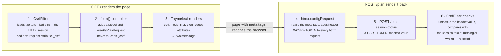

# How the CSRF Token Reaches the Page

`${_csrf}` in [`index.html`](../src/main/resources/templates/index.html) line 8 is not a model attribute. Spring Security stores the token as a request attribute on every request, and Thymeleaf lets templates read request attributes by name.

## The path

The token goes out as a request attribute when the page is rendered, and comes back as a header on each htmx POST.



1. **`CsrfFilter` runs on every request**, including `GET /`, before the controller. It loads the token from the token repository (by default `HttpSessionCsrfTokenRepository`, which keeps it in the HTTP session). Then `CsrfTokenRequestAttributeHandler` stores it as request attributes:

    ```java
    request.setAttribute(CsrfToken.class.getName(), csrfToken);
    request.setAttribute("_csrf", csrfToken);   // "_csrf" is the default csrfRequestAttributeName
    ```

2. **The controller doesn't add it.** `NutritionPlannerUiController.form()` only puts `aiModel` and `weeklyPlanRequest` in the model.
3. **Thymeleaf reads request attributes as template variables.** In Spring MVC, `${name}` looks in the model first, then in request attributes. So `${_csrf}` resolves to the `CsrfToken`, and lines 8–9 write it into two `<meta>` tags.
4. **The htmx listener sends it back.** An `htmx:configRequest` listener reads the meta tags and adds the `X-CSRF-TOKEN` header to every htmx request. That includes the question form that arrives later over SSE.
5. **`CsrfFilter` checks it on the POST.** It unmasks the header value and compares it with the session token. If the header is missing or wrong, the request is rejected: 403 when logged in, 401 when not.

## What lines 8–9 read

`${_csrf}` is a `CsrfToken`, so Thymeleaf's `.token` and `.headerName` call its getters.

```html
<meta name="_csrf" th:content="${_csrf.token}"/>
<meta name="_csrf_header" th:content="${_csrf.headerName}"/>
```

| Expression | Calls | Value |
| --- | --- | --- |
| `${_csrf.token}` | `getToken()` | The token string, masked (see below) |
| `${_csrf.headerName}` | `getHeaderName()` | `X-CSRF-TOKEN` (confirmed against the running app) |
| `${_csrf.parameterName}` (not used here) | `getParameterName()` | `_csrf`, the name of the hidden form field |

## Two details worth knowing

**The token is deferred.** Since Spring Security 6, `CsrfFilter` doesn't load or create the token up front; it stores a lazy wrapper. The real token is only loaded, or created and saved to the session, when something calls `getToken()`. Here, that's line 8 while the page renders. Pages that never touch the token don't pay for it.

**The value is masked, so it changes on every page load.** The default handler, `XorCsrfTokenRequestAttributeHandler`, returns the session token XOR-ed with random bytes. This protects against BREACH-style attacks on compressed responses.

- On the way back, the handler reverses the XOR on the `X-CSRF-TOKEN` header and compares the result with the session token.
- So a token from an older page load still works within the same session, even though the string looks different each time.
- Logging in replaces the session token (`CsrfAuthenticationStrategy`), so a page loaded before login has a stale token. `/` is only reachable after login, so this app never hits that.

## Login form vs. htmx

The login form gets the same token without any code, but htmx requests need it passed by hand.

| | `login.html` | `index.html` htmx POSTs |
| --- | --- | --- |
| How the request is made | Normal form with `th:action="@{/login}"` | `hx-post` (`/plan`, and `/interaction/{id}/answers` from the SSE fragment) |
| How the token gets in | Thymeleaf calls Spring's `RequestDataValueProcessor`. Spring Security's `CsrfRequestDataValueProcessor` adds `<input type="hidden" name="_csrf" value="…">` | Lines 8–9 put it in `<meta>` tags; the `htmx:configRequest` listener adds the `X-CSRF-TOKEN` header |
| Sent as | Form field `_csrf` | Header `X-CSRF-TOKEN` |

`hx-post` doesn't go through `th:action`, so the processor never sees those requests. That's why `index.html` reads the token explicitly.

`/mcp` is exempt (`csrf.ignoringRequestMatchers("/mcp", "/mcp/**")` in [`NutritionPlannerConfiguration`](../src/main/java/com/example/NutritionPlannerConfiguration.java)). MCP clients authenticate with HTTP Basic and have no page to read a token from.
